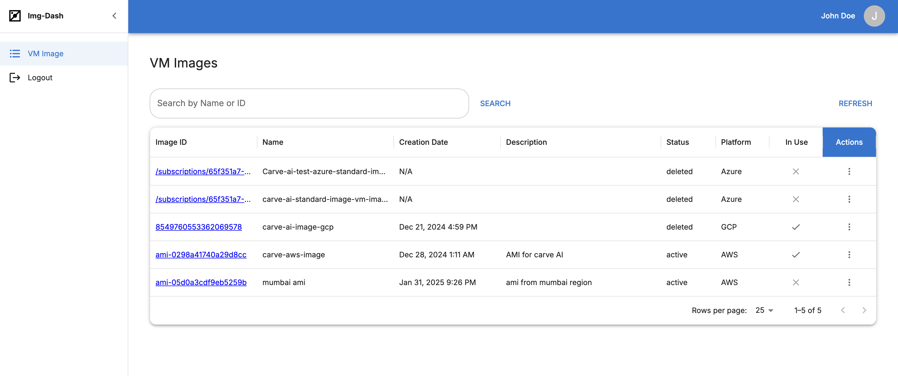
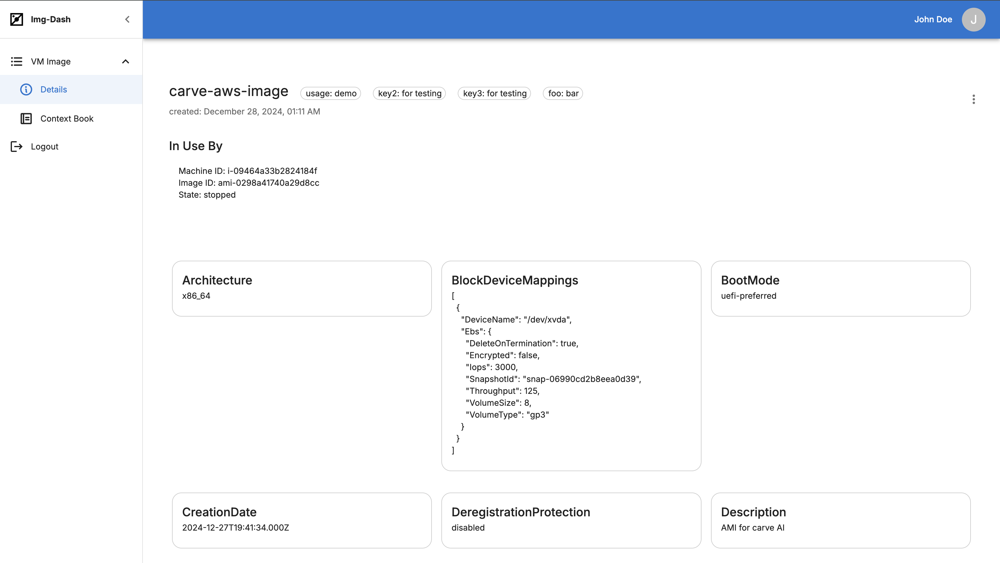

# Img-Dash

Img-Dash is a VM image management dashboard. It contextualises images from AWS, Azure, and GCP.



## Features

- Fetch and store image data from AWS, Azure, and GCP
- Show which VMs are using each image
- View, attach, or delete contextual information (context book)
- Simple search and list of images in the dashboard



## Tech Stack

- **Backend:** Python (Flask), MongoDB, Azure/AWS/GCP SDKs
- **Frontend:** React (Vite), MUI, Refine
- **Containerization:** Docker 

## Quick Start

1. **Configure Environment:** Update `.env` and `config.json` with your credentials and project IDs.

2. **Build & Run:**
   ```bash
   docker-compose up --build
   ```

3. **Access the Application:**
   Open your browser and navigate to `http://localhost:4173`.


## Permissions

### AWS

For the AWS requests in your code, you will need the following IAM policies and permissions:

1. **EC2 Read-Only Access**: This policy allows read-only access to EC2 resources, which includes the ability to describe instances and images.

```json
{
    "Version": "2012-10-17",
    "Statement": [
        {
            "Effect": "Allow",
            "Action": [
                "ec2:DescribeImages",
                "ec2:DescribeInstances"
            ],
            "Resource": "*"
        }
    ]
}
```

### Azure

Note: For Azure, you will need to assign the Reader role for your subscription

### GCP

Note: A service account key json file with the permissions: 
- List Projects IAM role
- List VM images IAM role


## Environment Variables

Ensure you have the following environment variables set in your `.env` file located in the parent directory:

```env
# AWS credentials
AWS_ACCESS_KEY_ID="your_aws_access_key_id" 
AWS_SECRET_ACCESS_KEY="your_aws_secret_access_key"

# GCP credentials
GOOGLE_APPLICATION_CREDENTIALS="path_to_your_service_account_key.json"
ORGANIZATION_ID="your_gcp_organization_id"
PROJECT_ID="your_gcp_project_id"

# Azure credentials
AZURE_TENANT_ID="your_azure_tenant_id"
AZURE_CLIENT_ID="your_azure_client_id"
AZURE_CLIENT_SECRET="your_azure_client_secret"
AZURE_SUBSCRIPTION_ID="your_azure_subscription_id"

# MongoDB credentials
MONGO_URI="your_mongodb_uri"
MONGO_DB_NAME="your_mongodb_database_name"
MONGO_COLLECTION_NAME="your_mongodb_collection_name"
MONGO_CONTEXT_COLLECTION_NAME="your_mongodb_context_collection_name"
```


## Configuration

Update the `config.json` file with your cloud platform configurations:

```json
{
    "enabled_cloud_platforms": {
        "aws": true,
        "azure": true,
        "gcp": true
    },
    "aws": {
        "regions": ["us-east-1", "us-west-2", "ap-south-1"]
    }
}
```

## License

This project is licensed under the GNU General Public License v3.0 (GPL-3.0). 